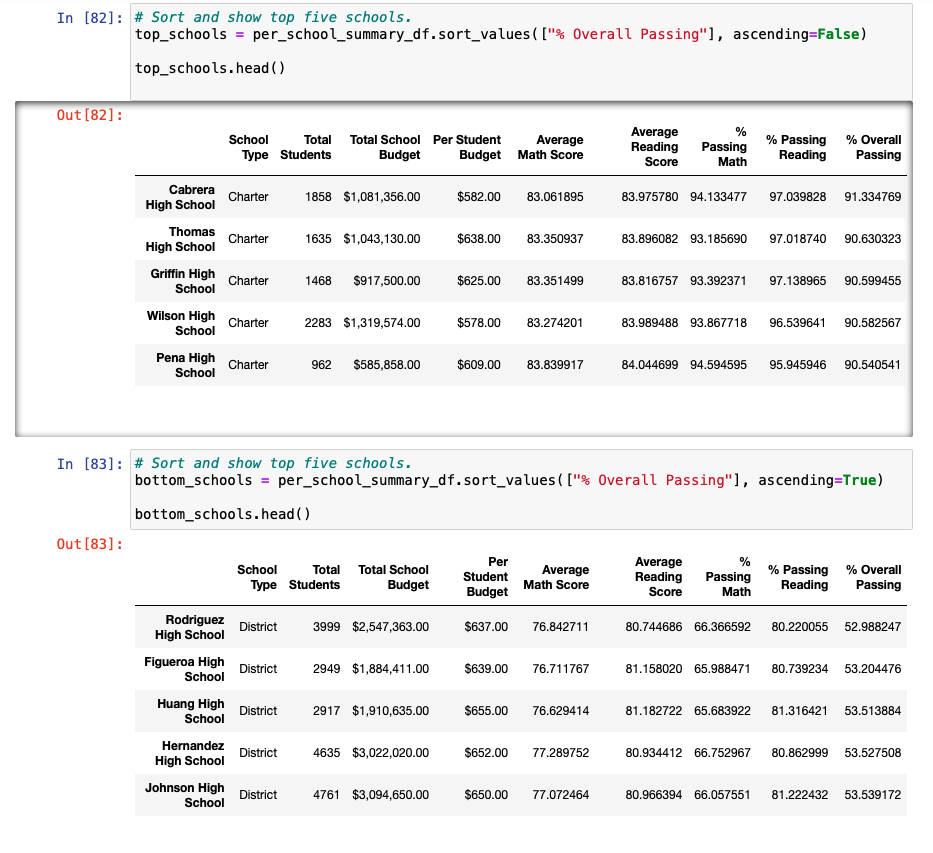
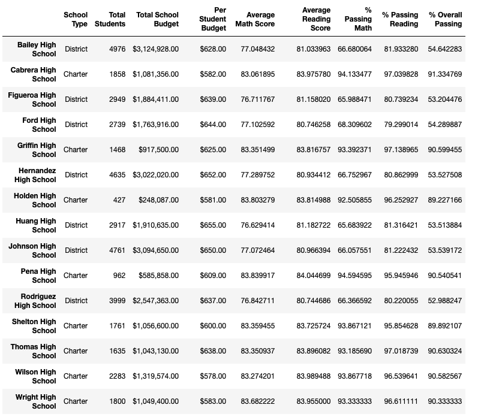

# School_District_Analysis
Analysis of school districs test scores

##Overview of School District Analysis
In this projects, I was tasked with running various analysis on the school districts data. This included analysing data per student and by school. Due to possible academic dishonest at one of the high school, I had to do redo all the original analysis after changing some of the students scores to Nan while keeping all the other data intact. 

## Results

-The school and district summary was not sigificantly impacted by the change in the data. The top and bottom 5 school in the sidtrict did not change. Thomas Hight School also maintatined its position as the #2 ranking highest performace high school. 

### How does replacing the ninth-grade scores affect the following:
  -Math and reading scores by grade: Thomas High Schools scores went down by less than 1% for both reading and math
  -Scores by school spending: Overall % of specding per student for $63-$644 price range went down
  -Scores by school size: Overall scores for medium school went up by less than .2%
  -Scores by school type: Charter school overall passing percentage went up by less than .2%

## Summary: 
As a result of replacing ninth grade math and reading score at Thomas High School (THS) with NaN's, THS overall performace went down. This change helped to increase the performace of charter schools. For the analysis, I had to update the total student count district wide in order to pull accurate percentages. This change also caused school spending per student to go down by less than 2% for the $630-$644 spending range. 
